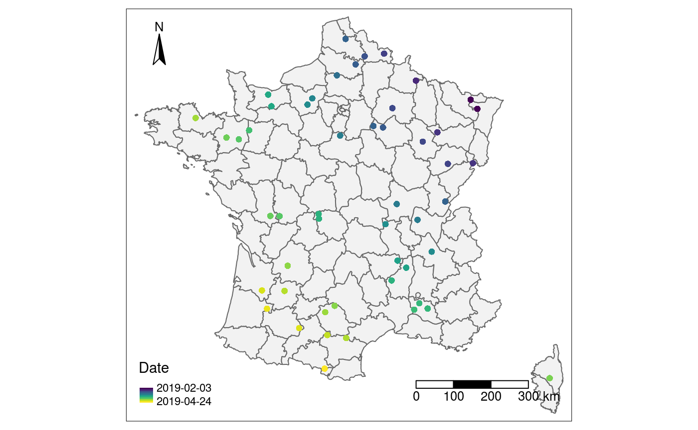
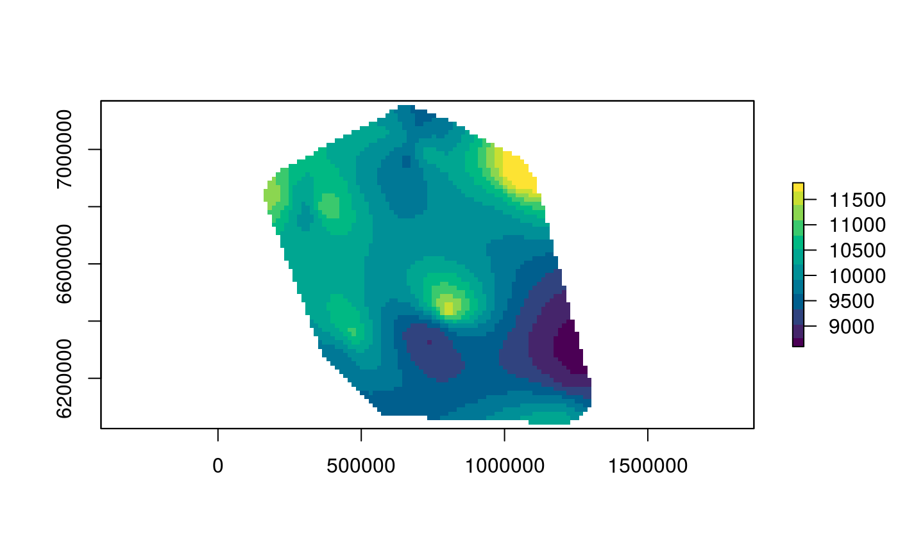
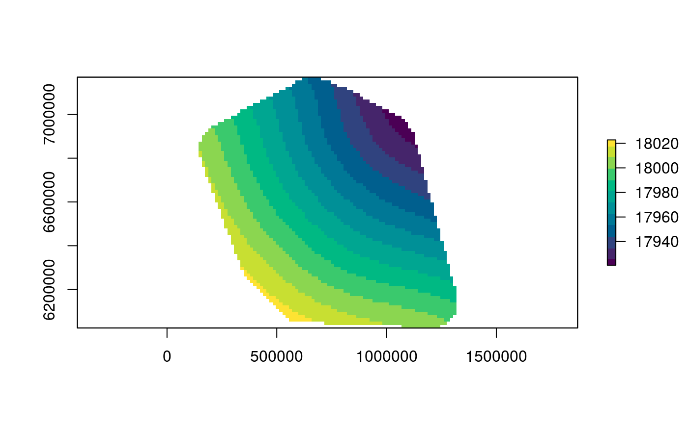

# spreadrate

## This project moved to https://forgemia.inra.fr/umr-astre/spreadrate/


<!-- badges: start -->

<!-- badges: end -->

The goal of spreadrate is to estimate the **local velocity of
propagation** of an epidemic event, given dates and locations of
observed cases.

The method estimates the surface of **first date of invasion** by
interpolation of the earliest observations in a neighbourhood and
derives the **local spread rate** as the inverse slope of the surface.

Furthermore, it helps to quantify the estimation uncertainty by a Monte
Carlo approach. Visualise and simulate the spatio-temporal progress of
epidemics.

## Installation

To install the latest version of spreadrate, copy and paste the
following in a R session.

``` r
if (!require("remotes")) {
  install.packages("remotes")
}
install.packages("INLA", repos="https://inla.r-inla-download.org/R/testing")
remotes::install_github("Cirad-ASTRE/mapMCDA")
```

## Example

Suppose that we have recorded the GPS coordinates and observation dates
for all the observed cases of some emerging disease in mainland France
into a table like this one.

    #> # A tibble: 50 x 3
    #>    date         Lon   Lat
    #>    <date>     <dbl> <dbl>
    #>  1 2019-02-03  7.05  49.0
    #>  2 2019-02-03  7.27  48.8
    #>  3 2019-02-12  5.07  49.5
    #>  4 2019-02-15  5.79  48.3
    #>  5 2019-02-16  7.01  47.5
    #>  6 2019-02-18  3.90  50.2
    #>  7 2019-02-19  6.12  47.5
    #>  8 2019-02-20  5.25  48.1
    #>  9 2019-02-21  4.18  48.9
    #> 10 2019-02-24  3.17  50.1
    #> # … with 40 more rows

Here is a visual representation of these observed cases.



First let `spreadrate` interpret the observational data appropriately
with the function `sr_obs()`. You need to specify the name of the
temporal variable. *Lon* and *Lat* are recognised automatically.

``` r
library(spreadrate)
cases_sr <- sr_obs(cases, "date")
```

However, spread-rate calculations require projected (rather than
geographic) coordinates. An appropriate projection for mainland France
is EPSG:2154. See <https://epsg.io/>.

``` r
cases_sr <- st_transform(cases_sr, crs = 2154)
```

Everything is now set to perform a default estimation of spread-rate.

``` r
sr_est <- sr(cases_sr)
#> Warning: 
#> Grid searches over lambda (nugget and sill variances) with  minima at the endpoints: 
#>   (GCV) Generalized Cross-Validation 
#>    minimum at  right endpoint  lambda  =  1.377511e-05 (eff. df= 41.79999 
#> )
```

Done\! Here is a quick plot of the estimated local spread-rate. The
estimated velocity is practically constant, between 9 and 11 km / day.

``` r
raster::plot(sr_est, col = hcl.colors(12))
```



This is consistent with the value of 10^{4} m/day used for simulating
the data.

We can also retrieve the estimated surface of first-date of invasion:

``` r
raster::plot(attr(sr_est, "fdoi"), col = hcl.colors(12))
```



## References

**Tisseuil, Clément, Aiko Gryspeirt, Renaud Lancelot, Maryline Pioz,
Andrew Liebhold, and Marius Gilbert (2016)**. Evaluating Methods to
Quantify Spatial Variation in the Velocity of Biological Invasions.
*Ecography* 39, no. 5: 409–418. <https://doi.org/10.1111/ecog.01393>.
